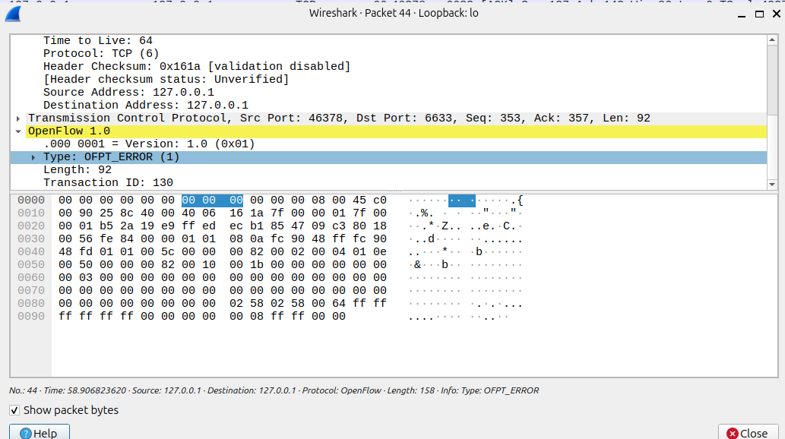

# SDN-Based Dynamic Host Blocking System (Interactive)

## Project Overview
This project implements a **Reactive Firewall** using the **POX Controller** and **Mininet**. Unlike static firewalls, this system is interactive and dynamic. The administrator can select a specific host to block at runtime. The system then detects packets from the selected host and installs a high-priority "Drop" rule in the switch to isolate the target, while ensuring other hosts communicate without interruption.

## Key Features
- **Interactive Target Selection:** Prompts the user to select the target host (H1, H2, or H3) at the time of controller startup.
- **Maximum Priority Enforcement:** Uses OpenFlow priority `65535` to ensure the firewall rule overrides any other default forwarding rules.
- **Reactive Flow Management:** Rules are pushed only when suspicious activity is detected via the `PacketIn` mechanism.
- **Traffic Isolation:** Successfully isolates the targeted intruder while maintaining connectivity between allowed hosts.

---

## Proof of Execution

### 1. Controller Logic (POX Logs)
The controller dynamically detects the selected target host and triggers the blocking mechanism.


### 2. Flow Table Verification
Verified the hardware-level 'Drop' rule installed in the switch (s1) using high priority.

| Priority | Match Criteria | Action | Logic |
| :--- | :--- | :--- | :--- |
| **65535** | `dl_src=SELECTED_MAC` | **DROP** | Highest priority security rule |
| 0 | *default* | **NORMAL** | Normal Layer-2 forwarding |


### 3. Network Connectivity Status
Final `pingall` results showing the targeted host is successfully isolated (X), while others communicate perfectly.


### 4. Detailed Host Analysis
- **Allowed Traffic:** Normal communication baseline between authorized hosts.
  
- **Blocked Traffic:** 100% packet loss for the targeted intruder.
  

### 5. Wireshark Packet Analysis
The following captures demonstrate the OpenFlow communication between the POX Controller and the Mininet Switch.

- **Capture 1: OpenFlow Protocol Overview**
  Shows the high-level sequence of communication. Note the transition from idle echo requests to active threat handling.
  
  
- **Capture 2: Detection Phase (Packet-In)**
  The switch encounters traffic with no matching flow entry and sends an `OFPT_PACKET_IN` message. The controller inspects the header and identifies the unauthorized MAC address.
  
  
- **Capture 3: Enforcement Phase (Flow-Mod)**
  The controller responds with an `OFPT_FLOW_MOD` command. This message instructs the switch to install a "DROP" rule for the specific intruder MAC, discarding all future packets.
  

- **Capture 4: Post-Blocking Verification**
  Further attempts by the blocked host result in dropped packets or termination of the specific flow, confirming the switch is enforcing the new security policy.
  

---

## How to Run

### Step 1: Clean the Environment
Before starting, clear any previous flows or hung processes from Mininet:
```bash
sudo mn -c
```
### Step 2: Start the POX Controller
Run the controller. The system will prompt you to interactively select which host to block (1, 2, or 3):
```bash
python3 pox/pox.py forwarding.firewall_blocking
```
### Step 3: Start Mininet Topology
Open a new terminal and launch the 3-host topology:
```bash
   sudo mn --topo single,3 --controller remote --mac
```
### Step 4: Verify Connectivity
In the Mininet CLI, test the network:
```bash
   pingall
```
The host you selected in Step 2 will show 100% packet loss, confirming the dynamic firewall is active.

**THANYK YOU!!**
