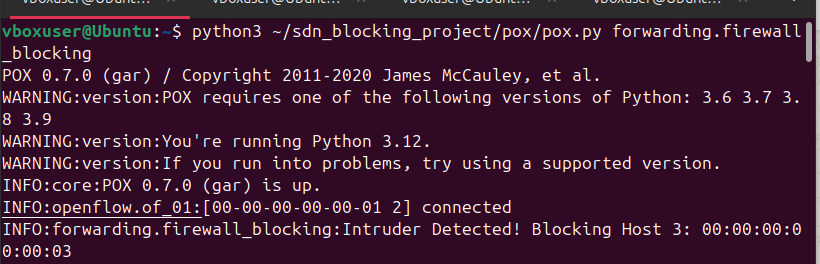
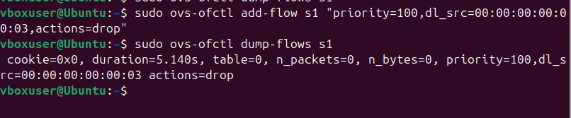
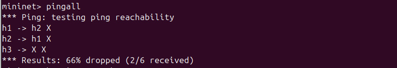
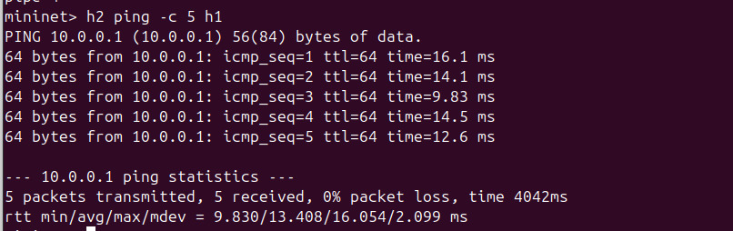
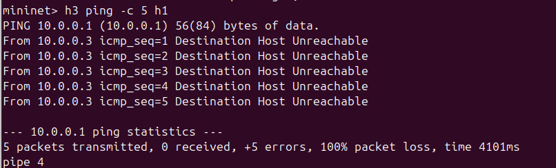

# SDN-Based Dynamic Host Blocking System

## Project Overview
This project implements a reactive firewall using the **POX Controller** and **Mininet**. The system is designed to dynamically detect an unauthorized host (Intruder) and install flow rules in the switch to block its traffic, while ensuring other hosts communicate without interruption.

## Features
- **Reactive Flow Management:** Rules are pushed only when suspicious activity is detected.
- **MAC-Based Filtering:** Automatically drops packets from the intruder's MAC address.
- **Traffic Isolation:** Successfully isolates Host 3 while maintaining connectivity between Host 1 and Host 2.

## Proof of Execution

### 1. Controller Logic (POX Logs)
The controller detects Host 3 and triggers the blocking mechanism.

### 2. Flow Table Verification
Verified the hardware-level 'drop' rule installed in the switch (s1).

### 3. Network Connectivity Status
Final `pingall` results showing Host 3 is isolated (X).

### 4. Detailed Host Analysis
- **Allowed Traffic (H2 to H1):** Normal communication baseline.
  
- **Blocked Traffic (H3 to H1):** 100% packet loss for the intruder.
  

## How to Run
1. **Start the Controller:**
   `python3 pox/pox.py forwarding.firewall_blocking`
2. **Start Mininet Topology:**
   `sudo mn --topo single,3 --controller remote --mac`
3. **Test Connectivity:**
   `mininet> pingall`
