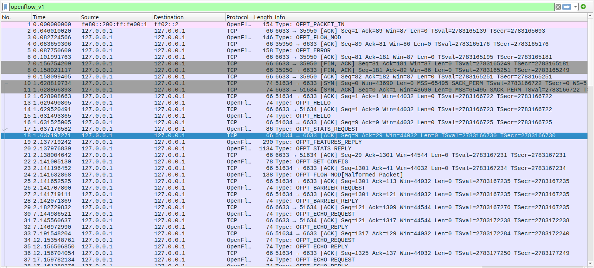
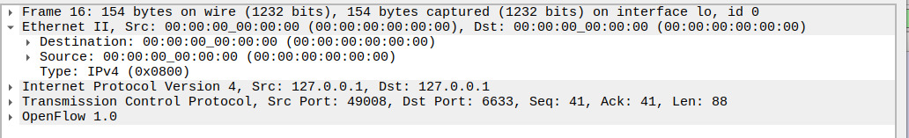
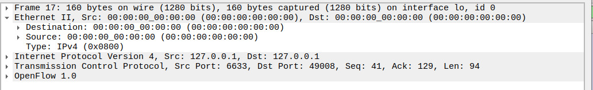

# SDN-Based Dynamic Host Blocking System

## Project Overview
This project implements a reactive firewall using the **POX Controller** and **Mininet**. The system is de$$  $$signed to dynamically detect an unauthorized host (Intruder) and install flow rules in the switch to block its traffic, while ensuring other hosts communicate without interruption.

## Features
- **Reactive Flow Management:** Rules are pushed only when suspicious activity is detected.
- **MAC-Based Filtering:** Automatically drops packets from the intruder's MAC address.
- **Traffic Isolation:** Successfully isolates Host 3 while maintaining connectivity between Host 1 and Host 2.

## Proof of Execution

### 1. Controller Logic (POX Logs)
The controller detects Host 3 and triggers the blocking mechanism.


### 2. Flow Table Verification
Verified the hardware-level 'drop' rule installed in the switch (s1).

| Priority | Match | Action | Notes |
|----------|-------|--------|-------|
| 1 | src_mac=MAC_OF_HOST3 | DROP | Intruder traffic blocked |
| 0 | default | NORMAL | Normal forwarding |


### 3. Network Connectivity Status
Final `pingall` results showing Host 3 is isolated (X).


### 4. Detailed Host Analysis
- **Allowed Traffic (H2 to H1):** Normal communication baseline.
  
- **Blocked Traffic (H3 to H1):** 100% packet loss for the intruder.
  
### 5. Wireshark Packet Analysis
The following captures demonstrate the OpenFlow communication between the POX Controller and the Mininet Switch.

- **Capture 1: OpenFlow Protocol Overview(wireshark1.jpg)**
  Shows the high-level sequence of communication. Note Frame 41, where the system transitions from idle echo requests to active threat handling.
  
  
- **Capture 2: Detection Phase (wireshark2.png - Frame 41)**
  The switch encounters traffic with no matching flow entry and sends an OFPT_PACKET_IN message to the controller. This allows the controller to inspect the header and identify the unauthorized MAC address.
  
  
- **Capture 3: Enforcement Phase (wireshark3.png - Frame 42)**
  The controller responds with an OFPT_FLOW_MOD command. This message instructs the switch to install a "DROP" rule for the specific intruder MAC, ensuring all future packets from this source are discarded at the switch level.
  
- **Capture 4: Post-Blocking Verification (wireshark4.png - Frame 44)**
Further attempts by the blocked host result in an OFPT_ERROR or termination of the specific flow, confirming that the switch is successfully enforcing the new security policy.

## How to Run
1. **Start the Controller:**
  ```bash
   python3 pox/pox.py forwarding.firewall_blocking
   ```
2. **Start Mininet Topology:**
   ```bash
   sudo mn --topo single,3 --controller remote --mac
   ```
3. **Test Connectivity:**
  ```bash
   mininet> pingall
   ```
